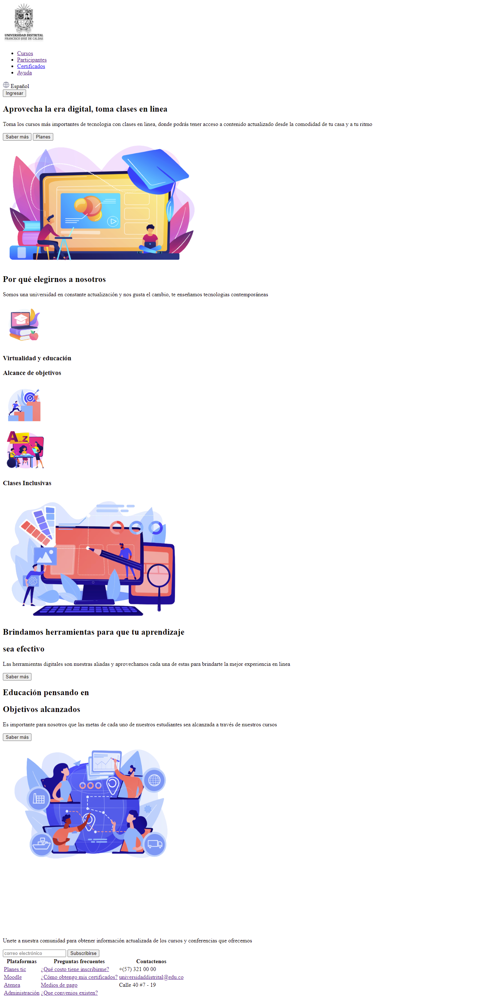

<h1>Taller 9 Nombre_del_estudiante</h1>

<h2> Información</h2>

Curso: full Stack Basico - Grupo 1

Profesor: Cristian Patiño

<h3> Link Página web </h3>
<a href="https://mafecamu.github.io/taller-9-full-stack/punto-1-3/index.html#section-2" target="blank">Link pagina web </a>

<h2> Punto 1: Link figma</h2>

<a href="https://www.figma.com/file/xdDqtOJV9vuwMKHwZoAIHb/Maria-C%C3%A1ceres---Proyecto-Figma?type=design&node-id=0%3A1&mode=design&t=QPBSFcV2pROWWgxF-1" target="_blank">Link de Figma</a>

<h2>Punto 2: HTML</h2>

<h2>Punto 3: CSS </h2>

